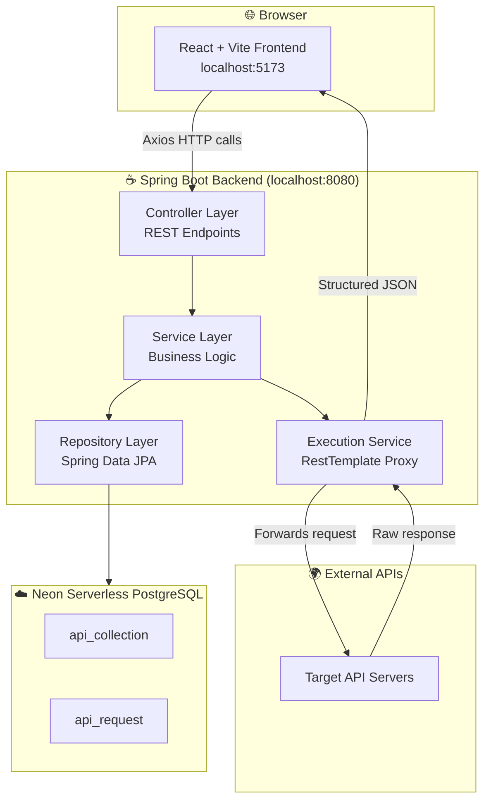
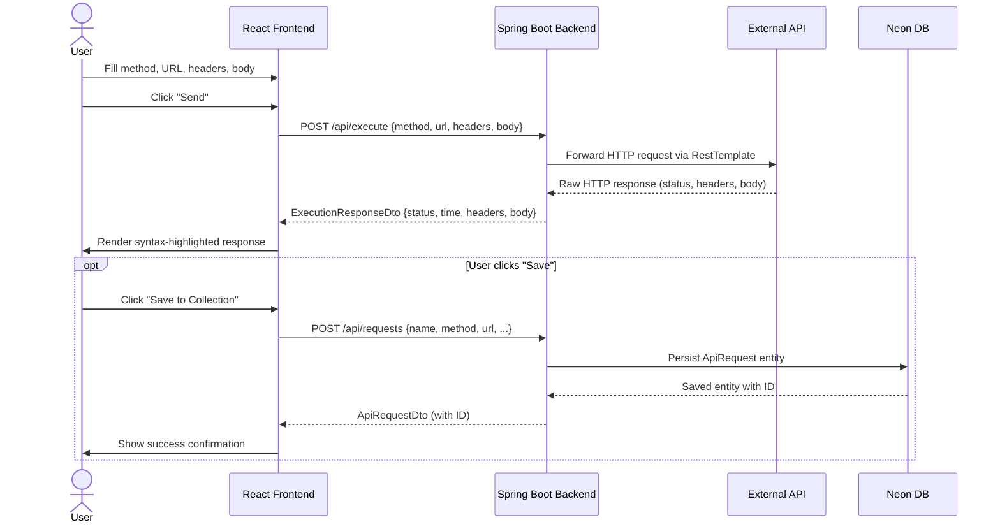
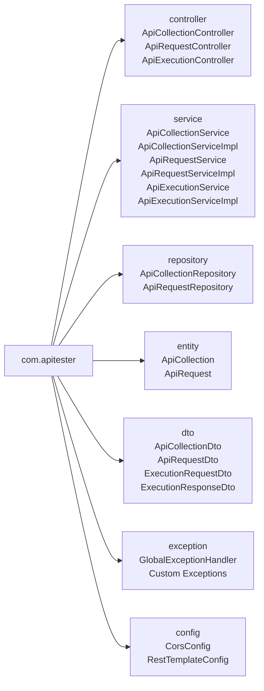
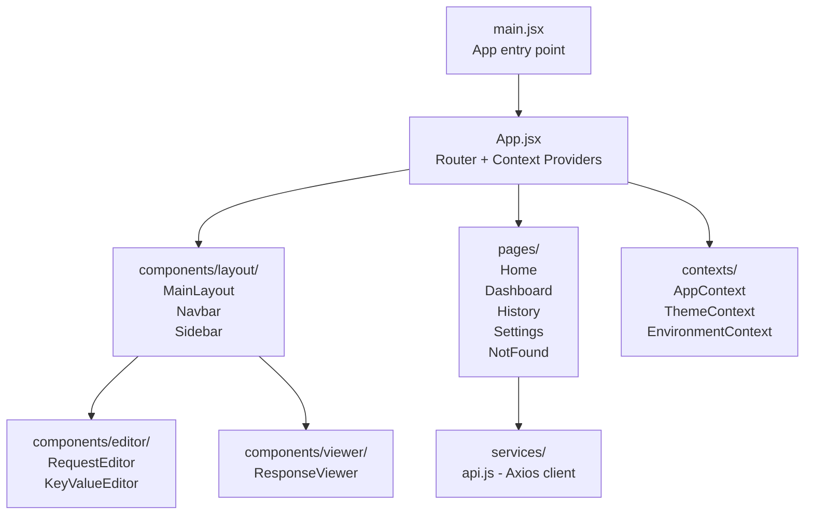
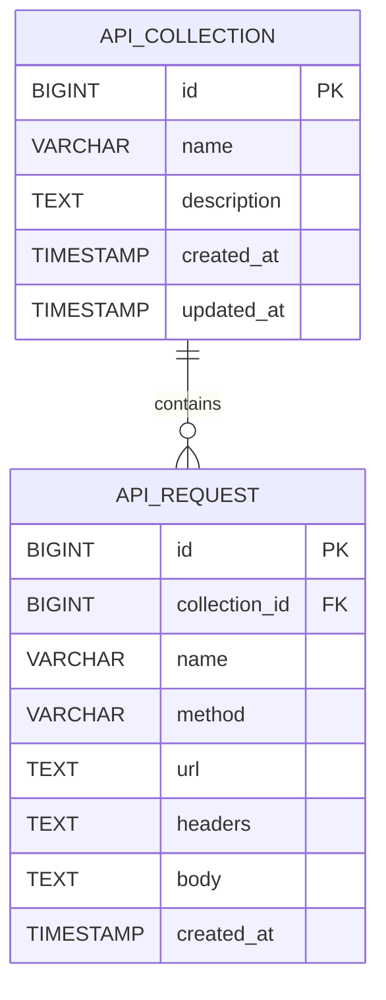

# APIFlow – Lightweight API Testing Tool

<div align="center">


**A modern, open‑source tool for quickly testing RESTful APIs.**
Craft requests, view formatted responses, and organize collections — all in one place.

</div>

---

## Table of Contents
- [Features](#features)
- [Tech Stack](#tech-stack)
- [Architecture](#architecture)
  - [System Overview](#system-overview)
  - [Request Execution Flow](#request-execution-flow)
  - [Backend Package Structure](#backend-package-structure)
  - [Frontend Module Structure](#frontend-module-structure)
  - [Database Schema](#database-schema)
- [Project Directory Structure](#project-directory-structure)
- [Getting Started](#getting-started)
  - [Prerequisites](#prerequisites)
  - [Backend Setup](#backend-setup)
  - [Frontend Setup](#frontend-setup)
- [Running the Application](#running-the-application)
- [Usage](#usage)
- [API Reference](#api-reference)
- [Future Enhancements](#future-enhancements)
- [License](#license)
- [Author](#author)

---

## Features

| Feature | Description |
|--------|-------------|
| 📡 **HTTP Methods** | Full support for GET, POST, PUT, PATCH, DELETE |
| 🎨 **Response Viewer** | Syntax-highlighted JSON, status code badge, response time, headers & body tabs |
| 📂 **Collections** | Save, search & delete named request collections |
| 🌍 **Environment Contexts** | Switch between environments via `EnvironmentContext` |
| 🛠️ **Swagger UI** | Auto-generated docs at `/swagger-ui.html` |
| 🌙 **Dark Mode** | Full dark/light theme toggle with `ThemeContext` |
| 📜 **Request History** | Browse past API calls via the History page |
| 📊 **Dashboard** | Overview of your testing activity |
| 📱 **Responsive UI** | Works across desktop and tablet viewports |

---

## Tech Stack

### Frontend
| Technology | Role |
|-----------|------|
| **React 18** | UI component framework |
| **Vite 5** | Build tool & dev server with HMR |
| **Tailwind CSS** | Utility-first styling |
| **Axios** | HTTP client for backend communication |
| **React Context API** | Global state (theme, environment, app state) |

### Backend
| Technology | Role |
|-----------|------|
| **Spring Boot 3** | Application framework & auto-configuration |
| **Spring Web** | REST controller layer & `RestTemplate` proxy |
| **Spring Data JPA** | ORM & repository abstraction |
| **[Neon](https://neon.tech)** | Serverless PostgreSQL — persistent storage for requests & collections |
| **SpringDoc / Swagger UI** | Interactive API documentation |
| **Maven** | Build & dependency management |

---

## Architecture

### System Overview



---

### Request Execution Flow



---

### Backend Package Structure



Each layer has a **single responsibility**:

| Package | Responsibility |
|---------|---------------|
| `controller` | Exposes REST endpoints; maps HTTP ↔ DTOs |
| `service` | Orchestrates business logic; interface + `Impl` pattern |
| `repository` | Spring Data JPA interfaces for DB access |
| `entity` | JPA-annotated domain objects (`@Entity`) |
| `dto` | Serializable request/response shapes (no JPA annotations) |
| `exception` | `@ControllerAdvice` global error handler + custom exceptions |
| `config` | CORS rules, `RestTemplate` bean definition |

---

### Frontend Module Structure



| Module | Role |
|--------|------|
| `contexts/` | React Context providers for theme, environment, and global app state |
| `components/layout/` | Shell UI — Navbar, collapsible Sidebar, MainLayout wrapper |
| `components/editor/` | Request builder — HTTP method selector, URL bar, headers/body editor |
| `components/viewer/` | Response panel — JSON pretty-print, status badge, timing, headers |
| `pages/` | Route-level views: Home, Dashboard, History, Settings, 404 |
| `services/api.js` | Centralised Axios instance with base URL & interceptors |

---

### Database Schema



---

## Project Directory Structure

```
API-Testing-Tool/
├── README.md
├── .gitignore
│
├── api-testing-backend/                    # Spring Boot application
│   ├── pom.xml                             # Maven build descriptor
│   └── src/main/
│       ├── java/com/apitester/
│       │   ├── ApiTestingApplication.java  # @SpringBootApplication entry point
│       │   ├── controller/
│       │   │   ├── ApiCollectionController.java   # /api/collections endpoints
│       │   │   ├── ApiRequestController.java      # /api/requests endpoints
│       │   │   └── ApiExecutionController.java    # /api/execute endpoint
│       │   ├── service/
│       │   │   ├── ApiCollectionService.java      # Interface
│       │   │   ├── ApiCollectionServiceImpl.java  # Implementation
│       │   │   ├── ApiRequestService.java         # Interface
│       │   │   ├── ApiRequestServiceImpl.java     # Implementation
│       │   │   ├── ApiExecutionService.java       # Interface
│       │   │   └── ApiExecutionServiceImpl.java   # RestTemplate proxy logic
│       │   ├── repository/
│       │   │   ├── ApiCollectionRepository.java
│       │   │   └── ApiRequestRepository.java
│       │   ├── entity/
│       │   │   ├── ApiCollection.java             # @Entity: collections table
│       │   │   └── ApiRequest.java                # @Entity: requests table
│       │   ├── dto/
│       │   │   ├── ApiCollectionDto.java
│       │   │   ├── ApiRequestDto.java
│       │   │   ├── ExecutionRequestDto.java       # Inbound execution payload
│       │   │   └── ExecutionResponseDto.java      # Outbound response envelope
│       │   ├── exception/                         # GlobalExceptionHandler + custom errors
│       │   └── config/                            # CorsConfig, RestTemplate bean
│       └── resources/
│           └── application.properties             # DB, port, JPA, Swagger settings
│
└── api-testing-frontend/                   # React + Vite application
    ├── package.json
    ├── vite.config.js                       # Dev proxy: /api → localhost:8080
    ├── tailwind.config.js
    └── src/
        ├── main.jsx                         # ReactDOM entry, wraps context providers
        ├── App.jsx                          # Router + context provider tree
        ├── index.css                        # Global styles + Tailwind layers
        ├── contexts/
        │   ├── AppContext.jsx               # Global app state
        │   ├── ThemeContext.jsx             # Dark/light mode toggle
        │   └── EnvironmentContext.jsx       # Base URL / env variable management
        ├── components/
        │   ├── layout/
        │   │   ├── MainLayout.jsx           # Page shell / grid layout
        │   │   ├── Navbar.jsx               # Top navigation & theme toggle
        │   │   └── Sidebar.jsx              # Collections panel & nav links
        │   ├── editor/
        │   │   ├── RequestEditor.jsx        # Full request builder (method, URL, tabs)
        │   │   └── KeyValueEditor.jsx       # Reusable key-value pair table editor
        │   └── viewer/
        │       └── ResponseViewer.jsx       # Response display with status & JSON tabs
        ├── pages/
        │   ├── Home.jsx                     # Main request/response workspace
        │   ├── Dashboard.jsx                # Activity & statistics overview
        │   ├── History.jsx                  # Past request history browser
        │   ├── Settings.jsx                 # App preferences & configuration
        │   └── NotFound.jsx                 # 404 fallback page
        └── services/
            └── api.js                       # Axios instance (baseURL, default headers)
```

---

## Getting Started

### Prerequisites

| Requirement | Minimum Version |
|------------|----------------|
| Node.js | ≥ 18 |
| Java JDK | ≥ 17 |
| Maven | ≥ 3.8 |
| [Neon](https://neon.tech) account | Free tier available (serverless PostgreSQL) |

### Backend Setup

```bash
# Clone the repository
git clone https://github.com/javvajishalini/API-Testing-Tool.git
cd API-Testing-Tool/api-testing-backend

# Create a Neon project at https://neon.tech and copy the connection string

# Review / update DB credentials
# → src/main/resources/application.properties
#   spring.datasource.url=jdbc:postgresql://<your-neon-host>.neon.tech/api_flow_db?sslmode=require
#   spring.datasource.username=your_neon_user
#   spring.datasource.password=your_password

# Build and run
mvn clean install
mvn spring-boot:run
```

### Docker Setup

```bash
# Build the Docker image (run from the backend directory)
cd api-testing-backend
docker build -t api-testing-backend .

# Run the container (replace env values with your own)
docker run -p 8080:8080 \
  -e SPRING_DATASOURCE_URL=jdbc:postgresql://<your-neon-host>.neon.tech/api_testing_tool?sslmode=require \
  -e SPRING_DATASOURCE_USERNAME=your_user \
  -e SPRING_DATASOURCE_PASSWORD=your_password \
  api-testing-backend
```


> The backend starts on **http://localhost:8080**.
> Swagger UI is available at **http://localhost:8080/swagger-ui.html**

### Frontend Setup

```bash
cd ../api-testing-frontend
npm install
npm run dev
```

> The frontend is served at **http://localhost:5173**.
> All `/api/*` requests are proxied to the Spring Boot backend via `vite.config.js`.

---

## Running the Application

1. Ensure your **Neon** database is provisioned (always available — serverless).
2. In **Terminal 1** — start the backend:
   ```bash
   cd api-testing-backend
   mvn spring-boot:run
   ```
3. In **Terminal 2** — start the frontend:
   ```bash
   cd api-testing-frontend
   npm run dev
   ```
4. Open **http://localhost:5173** in your browser.

### How It Works

- **Backend**: Spring Boot runs on port 8080, exposing `/api/*` endpoints. It connects to **Neon** (serverless PostgreSQL) for persisting collections and requests. The `ApiExecutionService` proxies API calls using `RestTemplate` with UTF‑8 encoding.
- **Frontend**: React (Vite) runs on port 5173. All `/api/*` calls are proxied to the backend via `vite.config.js`. The UI lets you build requests, view formatted responses, and save them to collections.
- **Docker**: You can run the backend in a container; the same environment variables are used for database connectivity.
- **Full flow**: When you click **Send**, the frontend sends a POST to `/api/execute`. The backend forwards the request to the target API, returns the structured response, which the UI displays. Saving a request sends a POST to `/api/requests`, persisting the data.


---

## Usage

| Task | How To |
|------|--------|
| **Send a Request** | Select HTTP method → Enter URL → Add headers/body → Click **Send** |
| **Save to Collection** | After a request, click **Save** and choose or create a collection |
| **Browse Collections** | Use the left **Sidebar** to expand collections and load saved requests |
| **Search Collections** | Use the search bar at the top of the Sidebar panel |
| **Switch Theme** | Toggle dark/light mode from the **Navbar** |
| **View History** | Navigate to the **History** page from the Sidebar |
| **Swagger Docs** | Visit `http://localhost:8080/swagger-ui.html` |

---

## API Reference

The backend exposes three groups of REST endpoints:

| Group | Base Path | Description |
|-------|-----------|-------------|
| **Execution** | `POST /api/execute` | Proxy-execute an HTTP request against any external API |
| **Requests** | `/api/requests` | CRUD for saved API request records |
| **Collections** | `/api/collections` | CRUD for named request collections |

Full interactive documentation is available via Swagger UI at:
`http://localhost:8080/swagger-ui.html`

---

## Future Enhancements

- [ ] 🔐 Authentication support (Bearer token, Basic Auth, API Key)
- [ ] 🌍 Environment variable management UI
- [ ] 📜 Persistent request history with pagination
- [ ] 📦 Import / Export collections (Postman JSON, OpenAPI)
- [ ] 📊 Response analytics dashboards (timing charts, status distribution)
- [ ] 🗂️ Workspace / multi-project support
- [ ] 🔄 Pre-request scripts and test assertions
- [ ] 🖥️ Desktop app packaging (Electron / Tauri)

---


## Author

**Shalini** – [GitHub Profile](https://github.com/javvajishalini)

---


