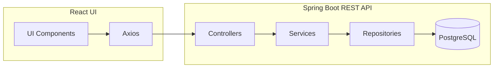

# <p align="center">

# **APIFlow** – Lightweight API Testing Tool

🛠️ **A modern, open‑source API testing suite** built with **React** & **Spring Boot**, offering a sleek UI, powerful request capabilities, and seamless Swagger integration.

---

## Badges

[](https://reactjs.org/)
[](https://spring.io/projects/spring-boot)
[](https://www.postgresql.org/)
[](https://opensource.org/licenses/MIT)
[](https://github.com/javvajishalini/API-Testing-Tool/stargazers)
[](https://github.com/javvajishalini/API-Testing-Tool/commits/main)

---

<details open>
  <summary><strong>🖼️ Project Preview</strong></summary>
  
  ### Home Page
  
  
  ### Request Editor
  
  
  ### Collections
  
  
  ### Response Viewer
  
</details>

---

## ✨ Features

- ✔️ **HTTP Methods** – `GET`, `POST`, `PUT`, `PATCH`, `DELETE`
- ✔️ **Beautiful Response Viewer** – formatted JSON, status code, response time, headers & body
- ✔️ **Collections** – save, search, delete requests for reuse
- ✔️ **Swagger Integration** – auto‑generate API docs
- ✔️ **Dark Mode** – sleek UI for day/night work
- ✔️ **Responsive Design** – works on desktop & tablet
- ✔️ **Real‑time Validation** – request syntax checking
- ✔️ **Export‑Ready** – easy copy‑paste of request snippets

---

## 🏗️ Project Architecture



---

## 📂 Folder Structure

```text
APIFlow/
├─ api-testing-backend/
│   ├─ src/main/java/com/apitester/
│   │   ├─ controller/        # REST controllers
│   │   ├─ service/           # Business logic
│   │   ├─ repository/        # JPA repositories
│   │   └─ model/             # Entity classes
│   ├─ src/main/resources/
│   │   └─ application.properties
│   └─ pom.xml                # Maven build file
├─ api-testing-frontend/
│   ├─ src/
│   │   ├─ components/       # UI widgets, Navbar, RequestEditor, etc.
│   │   ├─ contexts/         # Theme & Environment contexts
│   │   ├─ pages/            # Home, Settings, Collections
│   │   └─ services/         # Axios instance
│   ├─ tailwind.config.js
│   ├─ vite.config.js
│   └─ package.json
├─ .gitignore
├─ README.md                  # *THIS FILE*
└─ assets/
    └─ logo.png               # Project logo
```

---

## ⚙️ Installation Guide

### Prerequisites

- **Java 17+**
- **Maven 3.8+**
- **Node.js 20+** & **npm 10+**
- **PostgreSQL 15+**

### Backend

```bash
git clone https://github.com/javvajishalini/API-Testing-Tool.git
cd API-Testing-Tool/api-testing-backend

# Install dependencies & build
mvn clean install

# Run the Spring Boot server (default port 8090)
mvn spring-boot:run
```

### Frontend

```bash
cd ../api-testing-frontend
npm install
npm run dev   # Vite dev server → http://localhost:5173
```

### Database Setup

1. Create a database named `api_testing_tool`.
2. Update `src/main/resources/application.properties` with your credentials:

```properties
spring.datasource.url=jdbc:postgresql://localhost:5432/api_testing_tool
spring.datasource.username=postgres
spring.datasource.password=your_password
```

---

## 🌐 Environment Variables

| Layer | Variable | Description |
|-------|----------|-------------|
| Frontend | `VITE_API_URL` | Base URL for the backend (e.g., `http://localhost:8090/api`). |
| Backend | `spring.datasource.url` | JDBC URL for PostgreSQL. |
| Backend | `spring.datasource.username` | DB user. |
| Backend | `spring.datasource.password` | DB password. |

---

## 📡 API Endpoints

| Method | Endpoint | Description |
|--------|----------|------------- |
| `GET`    | `/api/collections` | Retrieve all saved request collections. |
| `POST`   | `/api/collections` | Create a new collection (request definition). |
| `PUT`    | `/api/collections/{id}` | Update an existing collection. |
| `DELETE` | `/api/collections/{id}` | Delete a collection. |
| `POST`   | `/api/execute` | Execute a request defined in the payload. |

---

## 🛠️ Technologies Used

**Frontend**: React, Vite, Tailwind CSS, Axios

**Backend**: Spring Boot, Spring Web, Spring Data JPA, Maven

**Database**: PostgreSQL

**CI / DevOps**: GitHub Actions (future), Docker (optional)

---

## 📸 Screenshots

<details>
  <summary>Click to expand screenshots</summary>
  
  ### Home Page
  
  
  ### Request Editor
  
  
  ### Collections
  
  
  ### Response Viewer
  
</details>

---

## 🚀 How It Works

1. **User enters request details** in the React editor (method, URL, headers, body).
2. **Axios** sends the request to the Spring Boot `/api/execute` endpoint.
3. The **backend** builds an `HttpURLConnection`, forwards the request to the target service, and captures the raw response.
4. **Response metadata** (status, time, headers) is packaged back to the frontend.
5. The **Response Viewer** pretty‑prints JSON, highlights status codes, and displays timing information.
6. Optionally, requests can be saved to **Collections**, persisted via JPA to PostgreSQL for later reuse.

---

## 📈 Future Scope & Enhancements

- 🔐 **Authentication** – Bearer token, Basic Auth, API keys
- 🌍 **Environment Variables** – per‑environment base URLs & secrets
- 📜 **Request History** – chronological log of all executed calls
- 📦 **Import/Export** – JSON / YAML collection files
- 📊 **Response Analytics** – aggregate stats, trends, and visual charts
- 🗂️ **Workspace Support** – multi‑project grouping

---

## 🤝 Contributing

Contributions are welcome! Please follow these steps:

1. Fork the repository.
2. Create a feature branch (`git checkout -b feat/awesome-feature`).
3. Write tests and ensure the existing suite passes.
4. Submit a Pull Request with a clear description of the changes.

See `CONTRIBUTING.md` for detailed guidelines.

---

## 📄 License

Distributed under the **MIT License**. See [LICENSE](LICENSE) for more information.

---

## 👤 Author

**Javvaji Shalini**  
[](https://www.linkedin.com/in/shalini-javvaji)  
[](https://github.com/javvajishalini)  
✉️ **Email:** [shalini@example.com](mailto:shalini@example.com)

---

## ⭐️ Star the Repository

If you find **APIFlow** useful, please give it a ⭐️! Your star helps the project gain visibility and motivates continued development.

---

<div align="center">
  Made with ❤️ using **React** + **Spring Boot**
</div>
