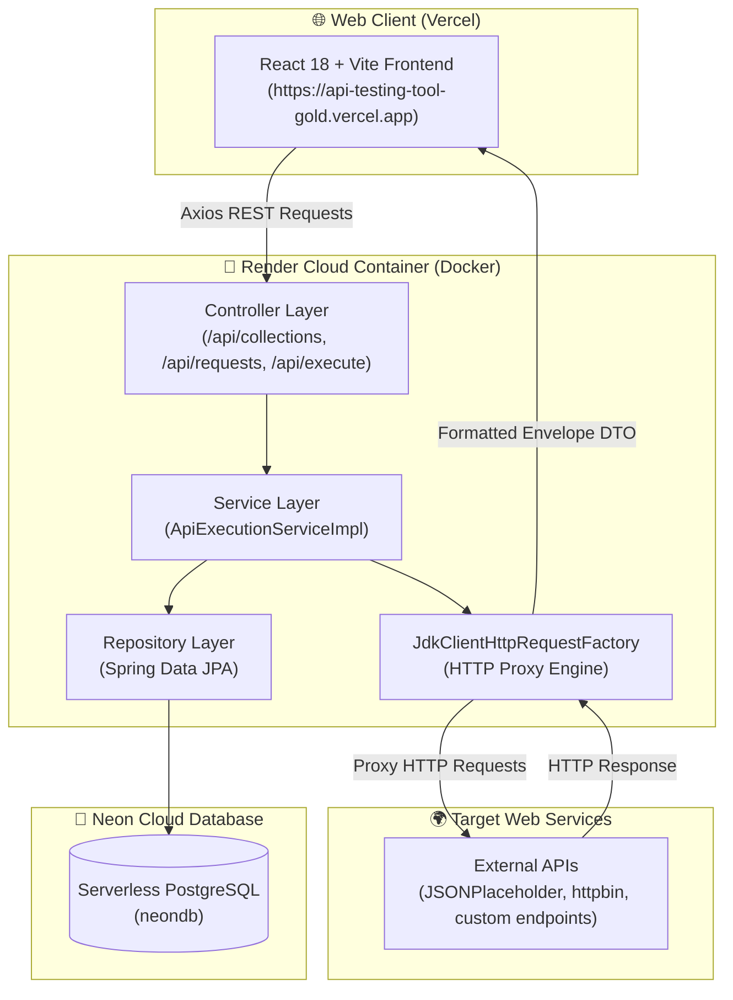

# APIFlow – Production-Grade API Testing Platform

<div align="center">


**A modern, open‑source full-stack platform for designing, testing, and debugging RESTful APIs.**  
Craft requests, execute full HTTP methods (GET, POST, PUT, DELETE, PATCH), import cURL commands, generate polyglot code snippets, and manage workspaces — all in one unified interface.

[**🌐 Live Frontend Demo**](https://api-testing-tool-gold.vercel.app/) • [**⚡ Live Render Backend**](https://api-testing-tool-1-ry22.onrender.com/api/swagger-ui.html)

</div>

---

## Table of Contents
- [Features](#features)
- [Tech Stack](#tech-stack)
- [Architecture & Deployment](#architecture--deployment)
  - [System Overview](#system-overview)
  - [Request Execution Flow](#request-execution-flow)
  - [Database Schema](#database-schema)
- [Docker & Deployment Guide](#docker--deployment-guide)
  - [Backend Deployment (Render + Docker + Neon PostgreSQL)](#backend-deployment-render--docker--neon-postgresql)
  - [Frontend Deployment (Vercel)](#frontend-deployment-vercel)
- [Getting Started Locally](#getting-started-locally)
  - [Prerequisites](#prerequisites)
  - [Backend Setup](#backend-setup)
  - [Frontend Setup](#frontend-setup)
- [API Reference](#api-reference)
- [Author](#author)

---

## Features

| Feature | Description |
|:---|:---|
| 📡 **Full HTTP Suite** | Complete support for `GET`, `POST`, `PUT`, `DELETE`, and `PATCH` powered by Spring `JdkClientHttpRequestFactory` |
| 🗂️ **Multi-Tab Workspace** | Work on multiple API endpoints simultaneously with in-memory `TabContext` & unsaved edit indicators (`●`) |
| 📥 **cURL Command Importer** | Instant regex parsing of raw cURL commands into method, URL, headers, and request body |
| 💻 **Polyglot Code Generator** | 1-click export of active requests into cURL, JavaScript (`fetch`/`axios`), Python (`requests`), and Java (`HttpClient`) |
| 🌍 **Environment Variables** | Interpolate dynamic environment variables (`{{baseUrl}}`, `{{token}}`) inside URLs, headers, and bodies |
| 🎨 **Response Inspector** | Pretty JSON formatting, raw output, header breakdown, copy-to-clipboard, and `.json` file download |
| 🛠️ **Swagger UI Docs** | Interactive OpenAPI v3 documentation hosted at `/api/swagger-ui.html` |
| 🐳 **Docker & Cloud Native** | Multi-stage Docker containerization deployed on Render with serverless Neon PostgreSQL |

---

## Tech Stack

### Frontend
| Technology | Role |
|:---|:---|
| **React 18** | UI component architecture |
| **Vite 5** | High-performance build tool with HMR |
| **Tailwind CSS** | Custom modern dark/light UI design |
| **Axios** | HTTP communication client with 60s cold-start timeout |
| **TabContext & EnvironmentContext** | Multi-tab workspace & variable interpolation engine |
| **Vercel** | SPA cloud hosting |

### Backend
| Technology | Role |
|:---|:---|
| **Spring Boot 3** | Backend REST application framework |
| **Spring Web + JdkClientHttpRequestFactory** | Cross-platform proxy execution engine for GET, POST, PUT, DELETE, PATCH |
| **Spring Data JPA** | Database ORM & persistence abstraction |
| **Neon PostgreSQL** | Serverless cloud PostgreSQL database |
| **Docker** | Multi-stage build runtime container (`eclipse-temurin:21-jre`) |
| **Render** | Docker container hosting service |

---

## Architecture & Deployment

### System Overview



---

## Docker & Deployment Guide

### Backend Deployment (Render + Docker + Neon PostgreSQL)

The backend includes a multi-stage `Dockerfile` located at [`api-testing-backend/Dockerfile`](file:///c:/Users/Shalini/OneDrive/Desktop/API-Testing-Tool/api-testing-backend/Dockerfile).

#### Render Web Service Configuration:
1. **Runtime:** Select `Docker`
2. **Root Directory:** `api-testing-backend`
3. **Environment Variables:**
   - `SPRING_DATASOURCE_URL` = `jdbc:postgresql://<neon-host>:5432/neondb?sslmode=require`
   - `SPRING_DATASOURCE_USERNAME` = `<neon_username>`
   - `SPRING_DATASOURCE_PASSWORD` = `<neon_password>`
   - `SPRING_JPA_HIBERNATE_DDL_AUTO` = `update`

```dockerfile
# Multi-stage Dockerfile Summary
FROM maven:3.9.6-eclipse-temurin-21 AS build
WORKDIR /app
COPY pom.xml .
RUN mvn dependency:go-offline -B
COPY src ./src
RUN mvn clean package -DskipTests

FROM eclipse-temurin:21-jre
WORKDIR /app
COPY --from=build /app/target/api-testing-backend-0.0.1-SNAPSHOT.jar app.jar
EXPOSE 8080
ENTRYPOINT ["java", "-jar", "app.jar"]
```

### Frontend Deployment (Vercel)

The frontend includes a [`vercel.json`](file:///c:/Users/Shalini/OneDrive/Desktop/API-Testing-Tool/api-testing-frontend/vercel.json) rewrite file for SPA route handling.

#### Vercel Environment Variables:
- `VITE_API_BASE_URL` = `https://api-testing-tool-1-ry22.onrender.com/api`

---

## Getting Started Locally

### Prerequisites
- Node.js ≥ 18
- Java JDK ≥ 17
- Docker Desktop (Optional for local container testing)
- PostgreSQL or Neon Database connection string

### Backend Local Setup
```bash
git clone https://github.com/javvajishalini/API-Testing-Tool.git
cd API-Testing-Tool/api-testing-backend

# Build & Run with Maven
mvn clean package -DskipTests
mvn spring-boot:run
```

### Frontend Local Setup
```bash
cd ../api-testing-frontend
npm install
npm run dev
```

> **Local Access Links:**
> - Frontend: `http://localhost:5173`
> - Backend Swagger Docs: `http://localhost:8090/api/swagger-ui.html`

---

## API Reference

| Endpoint | Method | Description |
|:---|:---|:---|
| `/api/collections` | `GET`, `POST` | List all collections or create a new collection |
| `/api/collections/{id}` | `GET`, `PUT`, `DELETE` | Retrieve, rename, or delete a specific collection |
| `/api/requests` | `GET`, `POST` | List requests by collection or create a new saved request |
| `/api/requests/{id}` | `GET`, `PUT`, `DELETE` | Retrieve, edit, or delete a saved request |
| `/api/execute` | `POST` | Proxy-execute HTTP requests (GET, POST, PUT, DELETE, PATCH) |

---

## Author

**Shalini** – [GitHub Profile](https://github.com/javvajishalini)
